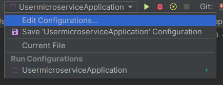
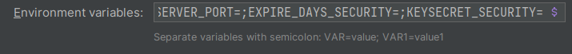
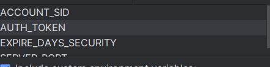

 

<h3 align="center">MESSENGER MICROSERVICE</h3>

### Built With

* 
* 
* 

<!-- GETTING STARTED -->
## Getting Started

To get a local copy up and running follow these steps.

### Prerequisites

* JDK 17 [https://jdk.java.net/java-se-ri/17](https://jdk.java.net/java-se-ri/17)
* Gradle [https://gradle.org/install/](https://gradle.org/install/)
* have a twilio account [https://www.twilio.com/login](https://www.twilio.com/login)
* You must have a restaurant linked to the sender tulio and a customer with the number you registered in tulio

### Recommended Tools
* IntelliJ Community [https://www.jetbrains.com/idea/download/](https://www.jetbrains.com/idea/download/)
* Postman [https://www.postman.com/downloads/](https://www.postman.com/downloads/)

### Installation

1. Clone the repository
2. Open project
3. Update environment variables
    
   3.1. Edit configurations 
   
    
   3.2. ACCOUNT_SID=;AUTH_TOKEN=;EXPIRE_DAYS_SECURITY=;SERVER_PORT=;
    
   copy this string into the "environment variables" field 
   
    
   3.3 Writes the respective values of each environment variable
    
   
<!-- USAGE -->
## Usage

1. Right-click the class PowerUpMessengerMicroserviceApplication and choose Run
2. Open [http://localhost:8092/swagger-ui/index.html](http://localhost:8092/swagger-ui/index.html) in your web browser

<!-- ROADMAP -->
## Tests

- Right-click the test folder and choose Run tests with coverage